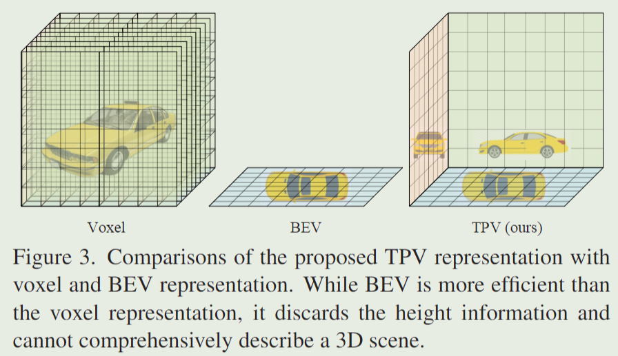
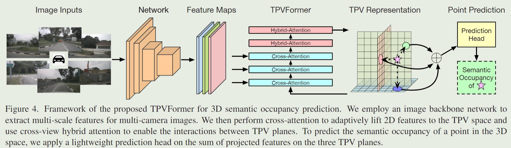

# TPVFormer   
流程   
1. 定义TPV特征：在BEV特征平面的基础上，将3D特征表示为3个相互正交平面（x,y,z）的特征之和，即3视图特征求和。将复杂度为O(HWD)的voxel降低为3个O(HW+HD+DW)的2D特征，每个面的正交轴都是无限长的pillar，类似于BEV的理解。
给定现实世界的3维坐标（x,y,z），voxel是基于三维坐标对voxel特征采样，而PTV是基于3个视图平面单独采样特征后相加。   
2. TPV query：list包含3个视图的2DV query（每个视图的2DV query形式与BEV query相同，只不过BEV是俯视图，而这是3种视图：正视图，侧视图以及俯视图的‘“BEV”）。后续attention操作也是用 for循环 以及 idx 提取出每个视图的2DV query进行独立操作。   
3. Cross-attention：对于一个2DV query的pillar采样得到3D点，然后映射到不同相机的2D image上，这些映射得到的2D点作为DCN的参考点（reference points），从2D feature中抽取特征，与BEVFormer类似。   
4. Self-attention：实现多视图特征之间的交互。对某视图中某位置的query，将该视图中该query的pillar均匀采样，映射到其他两个视图上得到2组参考点，在本视图的query周围随机采样得到本视图的1组参考点，基于这3组参考点作DCN。   
    
    
