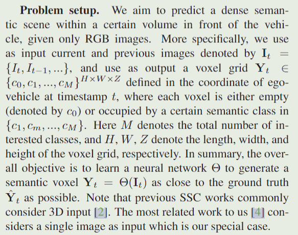

# VoxFormer   
    
> 学术界对Tesla Occupancy Network网络的复现和改进   

流程：   
1. 在stage1，基于现有的深度估计网络，预测2D图像中每个像素的深度Z，基于深度Z，2D坐标以及相机外参推算出粗略的合成3D点云；由于深度估计结果的不一致性和稀疏性导致粗略的合成3D点云不准确，采用现有的轻量级LMSCNet (UNet-like) 先验occ网络对粗糙合成3D点云进行校准，即通过2D卷积对每个voxel进行2分类 (free or occupied)去除free保留occupied，得到稀疏的voxel grid map，使得输出对深度误差更加鲁棒；对稀疏voxel进行reshape就得到初始化的query proposal；   
2. 在stage2，类似于BEVFormer，将3D点云投影到不同时刻的2D特征图上，将stage1中初始化的query与多时刻多位置的采样特征进行 DCN cross-attention，并将各时刻DCN结果求和作为最终输出完成query的更新；利用MAE的思路，将之前空缺的voxel用mask token补全，利用self-attention更新整个voxel features；   
3. 上采样预测占用和语义   
4. Loss：stage1采用二分类交叉熵损失（校准），stage2采用语义类别交叉熵损失以及scene-class affinity loss即上下文same or diff的关系损失   
    
